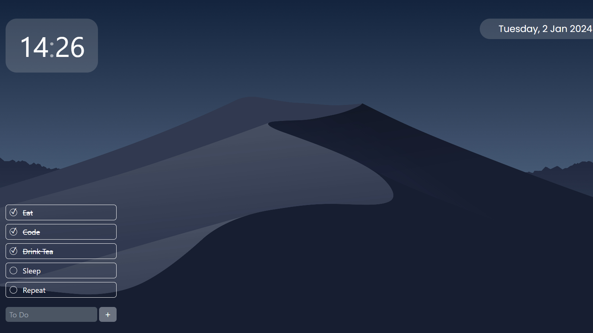

<center>

# ProductiVue



Minimalistic Peripheral View for my Productivity Sessions


</center>

## About

My goals for ProductiVue are:

- To provide a customizable, minimalistic view on my second monitor
- To be able to view chat from YouTube Live and Twitch stream in one source
- To practice my Vue, Typescript and Rust skills

## Setup

Download via git:

```
git clone https://github.com/liyunze-coding/ProductiVue.git
```

If you do not have pnpm:

```
npm install -g pnpm
```

Install via pnpm:

```
pnpm install
```

Start with Tauri (web and desktop app view):

```
pnpm run tauri dev
```

Or web view only

```
pnpm run dev
```

Build and get installer.exe in `src-tauri/target/release/bundle/nsis/ProductiVue_x.x.x_x64-setup.exe`:

```
pnpm run tauri build
```

## Notes

Can be compiled to work on the web, Windows, macOS and Linux.

